<div align="center">

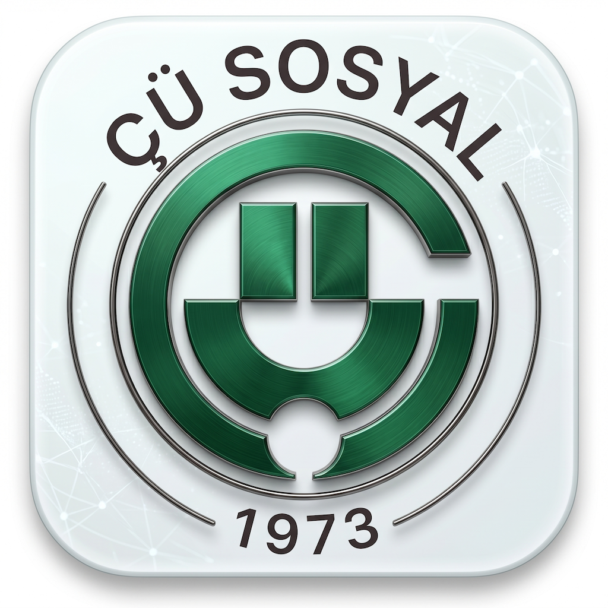

# ÇÜ Sosyal

**A campus social platform for university students — discover clubs, join events, and chat with an AI assistant.**

[](https://swift.org)
[](https://developer.apple.com/ios/)
[](https://developer.apple.com/documentation/uikit)
[](https://firebase.google.com)
[](https://ai.google.dev)

</div>

---

## Overview

**CuSosyal** is an iOS application that helps university students explore campus life. Students can browse student clubs, discover and reserve events, add them to their calendar, and talk to a personalized AI assistant that recommends clubs and events based on their interests. Admins get extra tools to manage clubs and events.

This project was built as a **graduation project** with the goal of being published on the **App Store**.

---

## Screenshots

| Login | Register | Home |
| :---: | :---: | :---: |
| 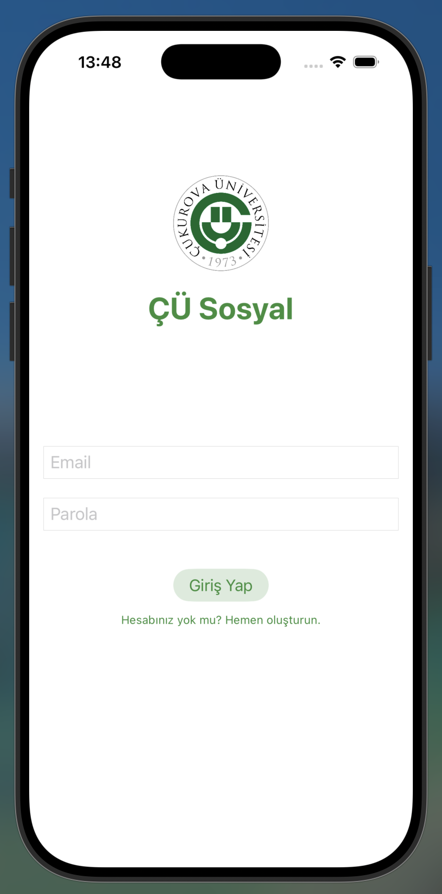 | 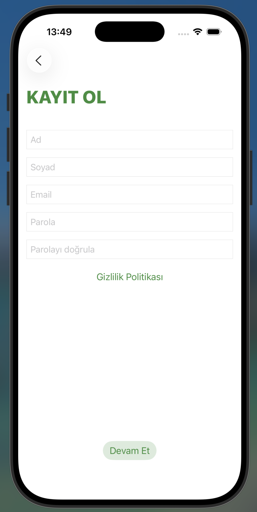 | 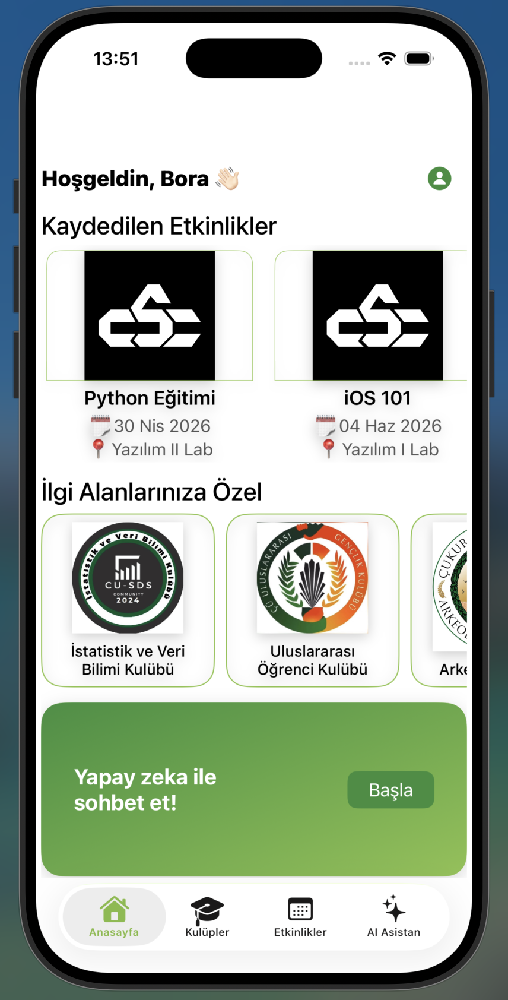 |

| Communities | Community Detail | Events |
| :---: | :---: | :---: |
| 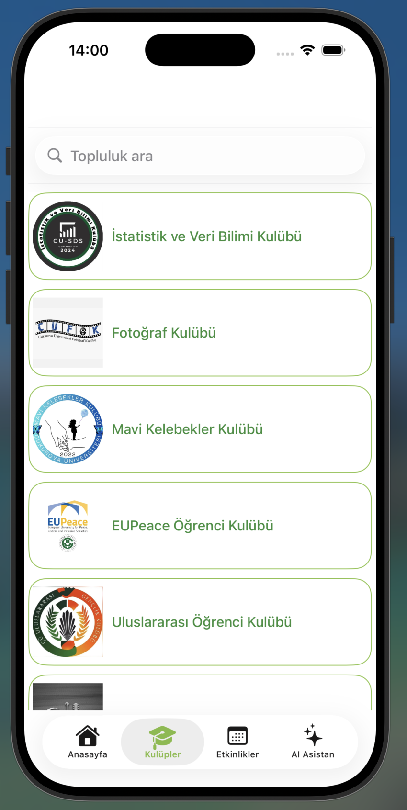 | 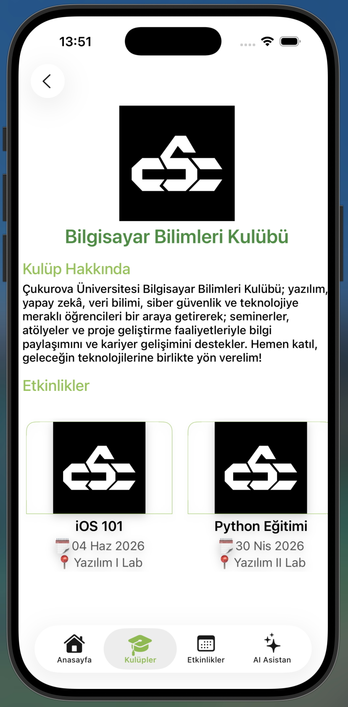 | 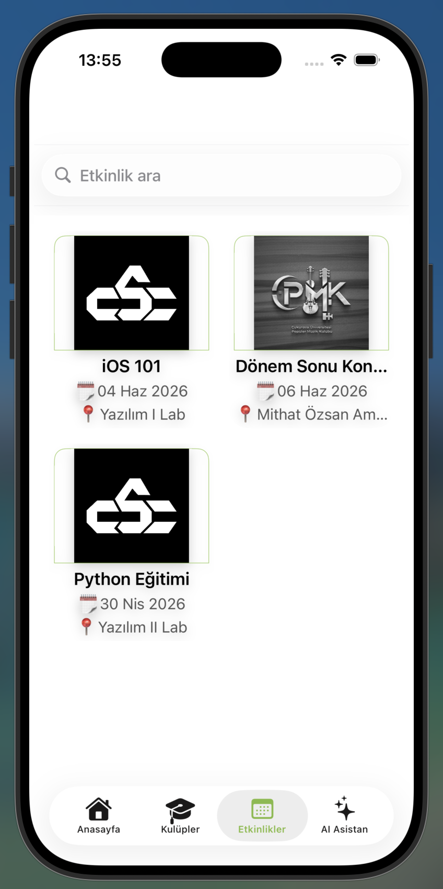 |

| Event Detail | AI Chat | Tags | Profile |
| :---: | :---: | :---: | :---: |
| 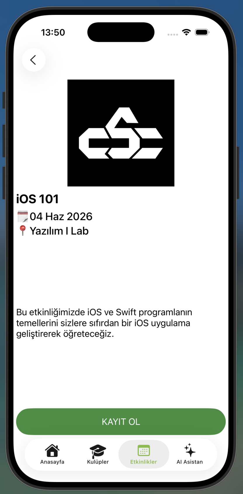 | 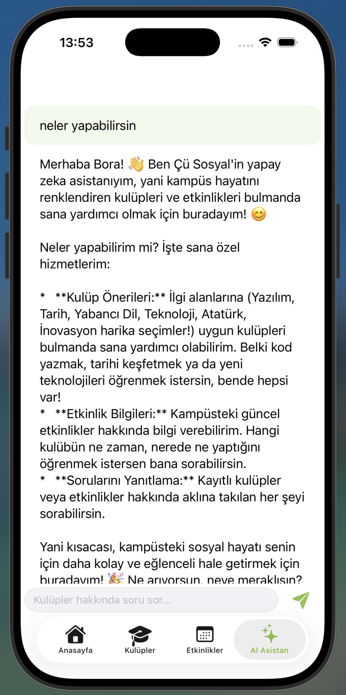 | 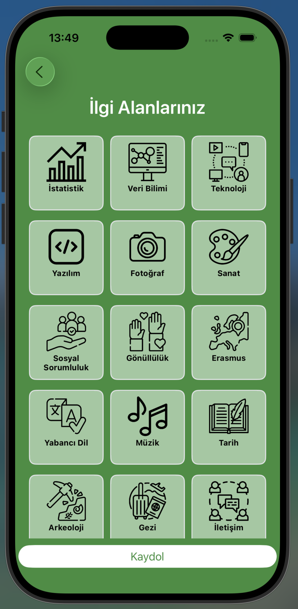 | 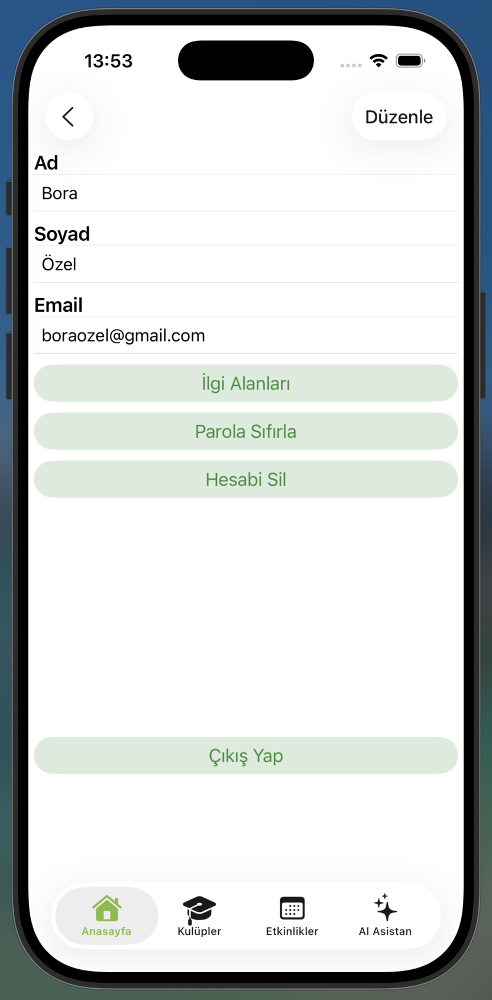 |

---

## Features

- **Authentication** — email/password registration & login, password reset, and account deletion (Firebase Auth).
- **Communities** — browse student clubs, view club details, and see related events.
- **Events** — search events, view details, **reserve a spot**, and **add the event to the system calendar** (EventKit).
- **AI Assistant** — a personalized chat assistant powered by **Google Gemini 2.5 Flash** that recommends clubs and events based on the user's interest tags.
- **Personalization** — a 50+ interest tag system that tailors recommendations to each user.
- **Role-based access** — separate capabilities for **admin** and **standard** users.
- **Admin tools** — create/edit/delete events and update club logos.
- **Profile** — manage account details and interests.

---

## Tech Stack

| Layer | Technology |
| --- | --- |
| Language | Swift |
| UI | UIKit + XIB (no SwiftUI) |
| Architecture | MVVM + Protocol-Driven |
| Authentication | Firebase Auth |
| Database | Cloud Firestore |
| Storage | Firebase Storage |
| AI | Google Generative AI (Gemini 2.5 Flash) |
| Image loading | SDWebImage |
| Calendar | EventKit |
| Photo picker | PHPickerViewController |
| Dependencies | Swift Package Manager |

---

## Architecture

CuSosyal follows an **MVVM + protocol-driven** design:

- **Scenes** — each screen is a pair of `…ViewController` + `…ViewModel`. View controllers stay thin and delegate logic to view models.
- **Managers** — singletons that wrap external services behind protocols (e.g. `AuthManagerInterface`, `AIManagerInterface`), making them easy to mock and test:
  - `AuthManager` — Firebase Auth + Firestore user records
  - `AIManager` — Gemini chat sessions
  - `CalendarManager` — EventKit integration
  - `NetworkManager` — Firestore data access
- **Navigation** — a lightweight `Router` decides between the auth flow and the main `MainTabBarController` based on sign-in state.

---

## Project Structure

```
CuSosyal/
├── CuSosyal.xcodeproj
└── CuSosyal/
    ├── Application/        # AppDelegate, SceneDelegate, Assets
    ├── Managers/           # AIManager, AuthManager, CalendarManager, NetworkManager
    ├── Models/             # Users, Communities, Events, Tags, errors, ChatMessage
    ├── Scenes/             # Login, Register, ResetPassword, Home, Communities,
    │                       # CommunityDetail, Events, EventDetail, AIChat,
    │                       # Profile, EditCommunity, EditEvent, Tags
    ├── CustomViews/        # Reusable collection view cells
    ├── Extensions/         # UIView/UIViewController helpers, Tags+UI
    └── Utilities/          # Router, MainTabBarController, custom flow layouts
```

---

## Privacy

CuSosyal has a published privacy policy, hosted as a static site under [`privacy-policy/`](privacy-policy/) (deployed via Firebase Hosting). The app supports **account deletion** in line with App Store requirements.

---

## Author

**Bora Özel** — [@BoraOzel](https://github.com/BoraOzel)

Built as a university graduation project.

---

<div align="center">
<sub>Bundle ID: <code>com.boraozel.CuSosyal</code> · Version 1.0</sub>
</div>
